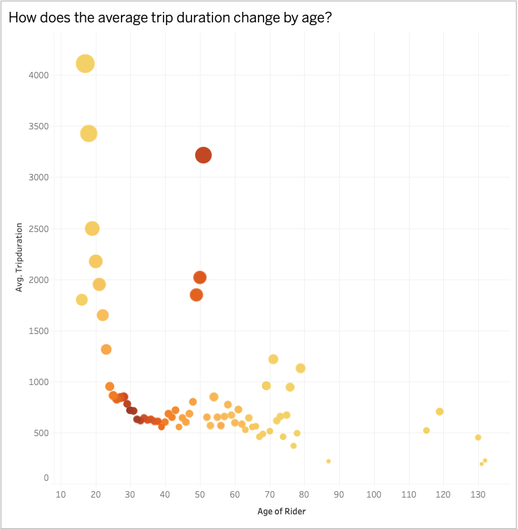

# Citi Bike Analytics
## Background

[New York Citi Bike](https://en.wikipedia.org/wiki/Citi_Bike) is a privately owned public bicycle sharing system serving the New York City boroughs of the Bronx, Brooklyn, Manhattan, and Queens, as well as Jersey City, New Jersey. Named after lead sponsor Citigroup, it is operated by Motivate (formerly Alta Bicycle Share), with former Metropolitan Transportation Authority CEO Jay Walder as chief executive until September 30, 2018 when the company was acquired by Lyft. The system's bikes and stations use BIXI-branded technology from PBSC Urban Solutions. This project is to oversee this largest bike sharing program in the United States and  generate insightful and dynamic reports to improve the city program through the power of [Tableau.](https://www.tableau.com/)

Since 2013, the Citi Bike Program has implemented a robust infrastructure for collecting data on the program's utilization. Through the team's efforts, each month bike data is collected, organized, and made public on the [Citi Bike Data](https://www.citibikenyc.com/system-data) webpage. For the analysis, recent data i.e, from 2018 January to 2020 August are collected and combined using code [here.](Code/DataMerge_2018_Jan_to_2020_August.ipynb)

### Please checkout the dashboards and stories !

Final work is published at Tableau Public account
- [Story 1](https://public.tableau.com/profile/bincy.narath#!/vizhome/NewYork_CitiBikeData_InsightsStory1/Story1)
- [Story 2](https://public.tableau.com/profile/bincy.narath#!/vizhome/NewYork_CitiBikeData_InsightsStory1/Story2)
- [UsageTransition Dashboard](https://public.tableau.com/profile/bincy.narath#!/vizhome/NewYork_CitiBikeData_Insights_UsageTransition/UsageTransition)
- [Diversity Dashboard](https://public.tableau.com/profile/bincy.narath#!/vizhome/NewYork_CitiBikeData_Insights_Diversity/DiversityDashboard)
- [All individual visuals and dashboards clubbed](https://public.tableau.com/profile/bincy.narath#!/vizhome/NewYork_CitiBikeData_Insights_Combined_Visuals/Combined)

## Phenomenons uncovered

- **All the city bike pickup points are in regions with median age below 35. However, riders have proved that age is just a number!**
It looks like the midlife crisis is pushing riders too. Though the frequent riders are between 25-35 age groups, there is a sudden surge around 50. Also, kids and age-groups around 50 are having higher trip duration. This might be because of the fact that they like to keep the bike for longer as well. **This is an indication that, opening new pickup points even in places of age groups around 50 is useful.**

- **Temporary customer segments are getting bigger over time** Targeted marketing towards temp customers might benefit!

- **Irrespective of winter or summer, there is a peek ride time** Being prepared during these busy hours (by more bikes in required locations) would improve customer satisfaction

- **Gender diversity and inclusion is getting better but way to go** Though most of the riders are male, it seems like gender outreach has been effective in increasing ridership over the timespan, however, miles to go further in this line ! 

- **Unequal usage of bikes**
Some bikes are overused (based on distance travelled) and some are rarely used. This might be because of the reason where they get parked. 
Finding a way to shuffle the bikes across locations can help distribute the wear and tear. Otherwise, identifying the overused bikes based on the interactive graph made helps to reduce the damage.

## Interactive graphs
  
There are many interactive graphs (based on slider or dropdown filters)
- Changing popularity of stations over time - Through animation and slider
  - Map1 & Map2
- Top 10 most/least active stations based on the day chosen
  - Visual4 - Visual 8 
- Gender breakdown of active participants (Male v. Female)? - Through animation and slider
- Which bikes (by ID) are most likely due for repair or inspection in the timespan? - Through slider

## Tableau solution file [here](FinalSubmission.twbx)
